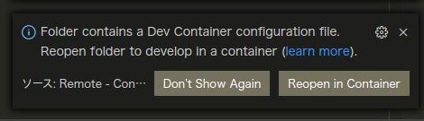
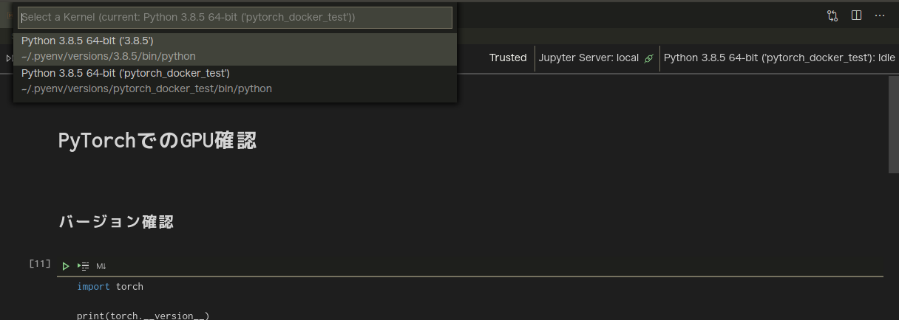

# PyTorchのDockerテスト(GPUまわり)
## Install

```bash
git clone https://github.com/Ry0/pytorch_docker_test
sudo docker build -t pytorch_docker_test .
sudo docker run pytorch_docker_test
```

VSCodeを使っている場合は、Reopen in Containerをクリックすれば、勝手にビルドが始まる（結構時間がかかる）。



## 動作テスト
`test_cuda.ipynb`でPyTorch経由でGPUがきちんと動作しているかを確認。

```bash
cd sample
```

Dockerfileで`pytorch_docker_test`というPython仮想環境を作成しているので、`pytorch_docker_test`がInterpreterになっているかを確認する。

